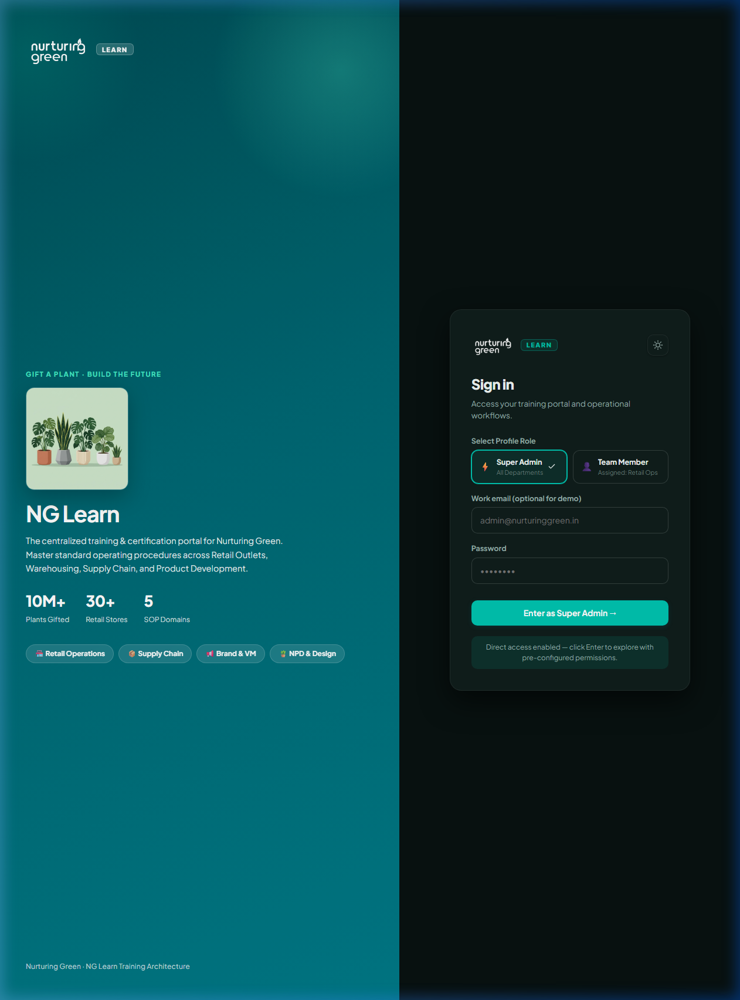
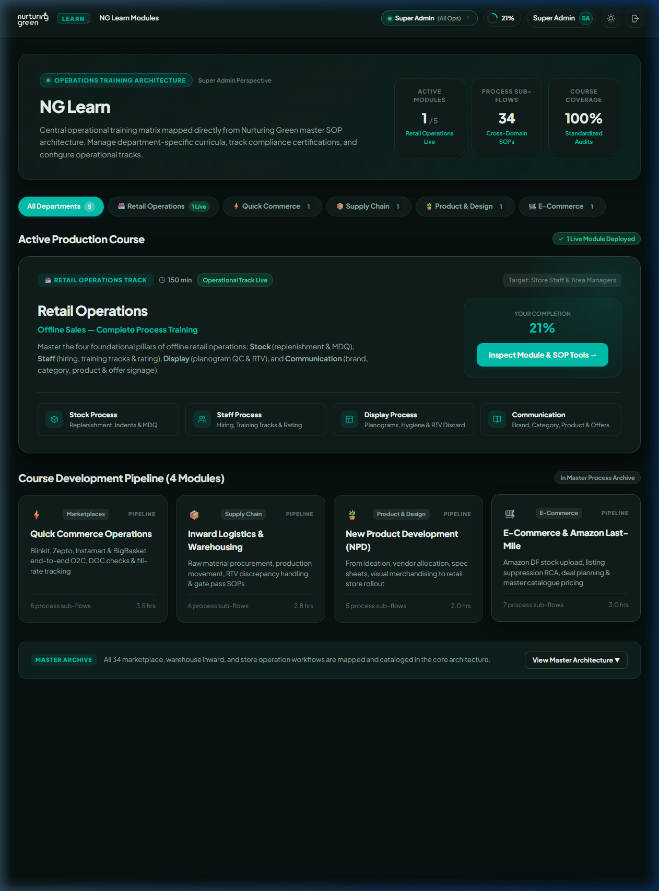
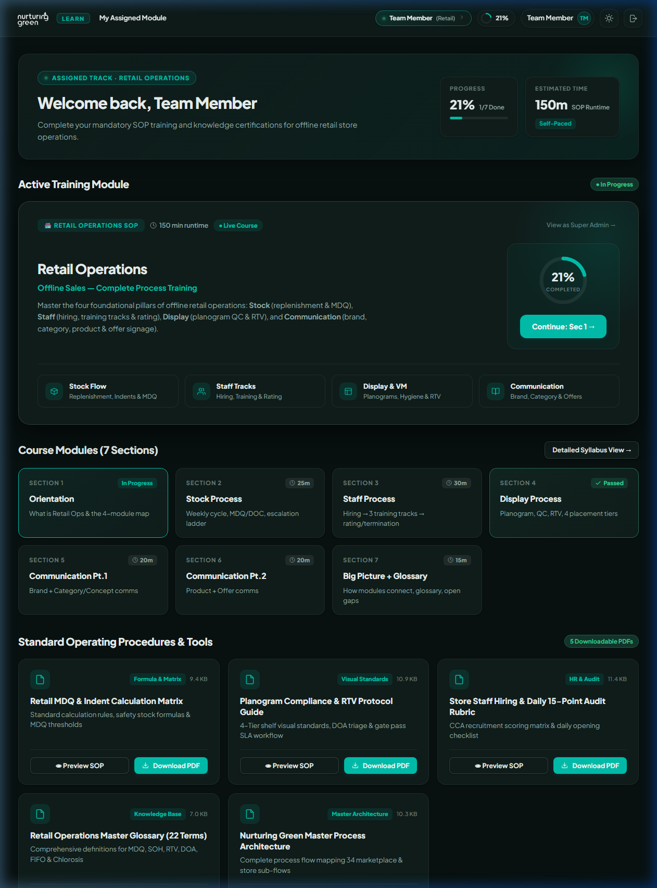
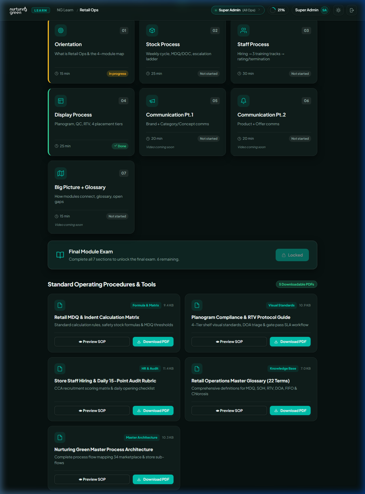
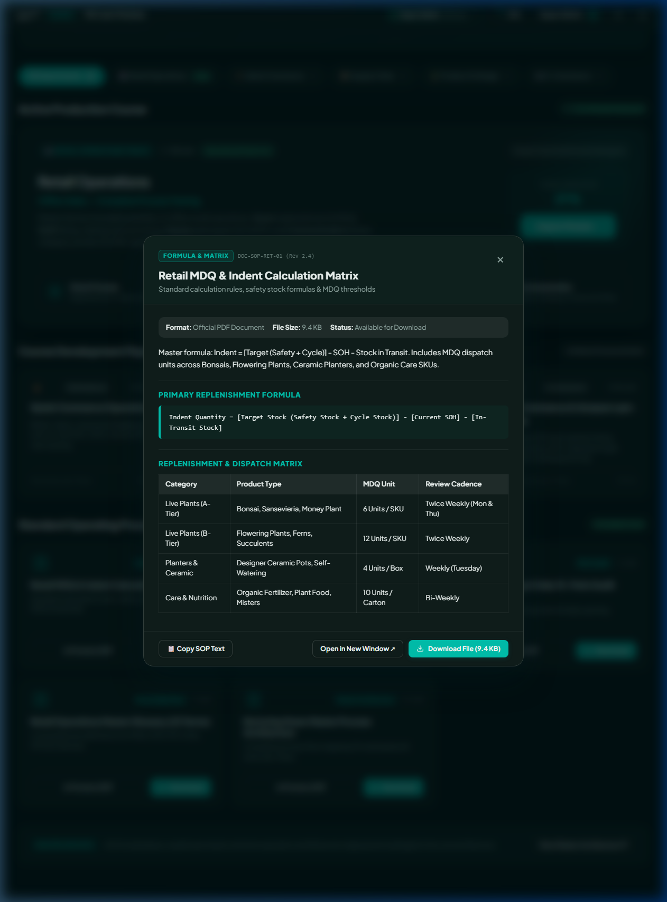
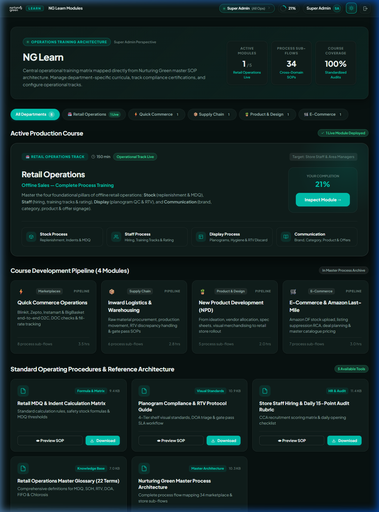

<p align="center">
  
</p>

<h1 align="center">NG Learn — Internal Operations &amp; Training Architecture</h1>

<p align="center">
  <strong>The centralized training, standard operating procedure (SOP) certification, and operations execution platform for Nurturing Green.</strong>
</p>

<p align="center">
  
  
  
  
  
  
</p>

---

## 🌿 Executive Overview

**NG Learn** is the official operational training and certification system engineered for **Nurturing Green** — India's premier plant-gifting brand with over **10M+ plants gifted** and **30+ retail outlets** alongside omnichannel operations across Quick Commerce (*Blinkit, Zepto, Instamart, BigBasket*), E-Commerce (*Amazon DF*), and nationwide warehouse logistics.

The portal digitizes and structures **34 cross-domain process workflows** into interactive learning tracks, knowledge benchmarks, printable **PDF SOP toolkits**, and role-governed operational dashboards.

```
                                  NG LEARN PORTAL
                                         │
        ┌────────────────────────────────┴────────────────────────────────┐
        ▼                                                                 ▼
 👑 SUPER ADMIN VIEW                                            👤 TEAM MEMBER VIEW
 ├── Executive Operations KPIs                                   ├── Assigned Department: Retail Operations
 ├── 5-Domain Architecture Filter                                ├── 4-Pillar Overview (Stock, Staff, VM, Comms)
 ├── Active Production Modules                                   ├── 7-Section Step-by-Step Curriculum
 ├── In-Development Pipeline                                     ├── Fast Resume Action & Radial Meter
 └── Master Cross-Domain Archive                                 └── Dedicated PDF SOPs & Inspection Tools
```

---

## 📸 Visual Showcase

### 1. Unified Login Portal & Brand Entry
Features official **`NG-LOGO-WHITE.png`** on the dark emerald gradient panel and **`NG-LOGO-BLUE.png`** on the sign-in card with instant profile role toggling (*Super Admin* vs. *Team Member*).



---

### 2. Super Admin Dashboard (Executive Matrix)
High-contrast operations KPIs (*Active Modules 1/5, Sub-Flows 34, Coverage 100%*), multi-department filter tabs (*All, Retail, Q-Commerce, Supply Chain, NPD, E-Commerce*), and course pipeline cards.



---

### 3. Team Member Dashboard (Assigned: Retail Operations)
A distraction-free, focused learning cockpit displaying the assigned **Retail Operations SOP**, interactive radial completion meter, 4-pillar cards, and 7-section progress checklist.



---

### 4. Retail Operations Module & In-Module SOP Suite
The complete 7-section curriculum syllabus with progress ring on the right, final exam gate, and **5 downloadable PDF SOP reference guides**.



---

### 5. Interactive SOP Preview & 100% PDF Downloads
Every operational procedure includes a modal preview showing formulas, SLA tables, visual hierarchies, and a **1-click PDF download**.



---

### 6. Seamless Dark Mode (Obsidian Emerald Theme)
Dynamic theme engine adapting typography, glassmorphism, and brand logos to pure white and luminous emerald (`#00E5BA`).



---

## 🎯 Role-Based Dashboard Architecture

| Feature | 👑 Super Admin Profile | 👤 Team Member Profile |
| :--- | :--- | :--- |
| **Default Identity** | `admin@nurturinggreen.in` (All Operations) | `retail.cca@nurturinggreen.in` (Retail Ops) |
| **Landing Scope** | Cross-department master catalog & KPIs | Laser-focused on assigned Retail Operations |
| **Department Filters** | Retail, Q-Comm, Supply Chain, NPD, E-Com | Hidden (Zero visual distractions) |
| **Pipeline Archive** | 34-subflow expandable master accordion | Hidden |
| **SOP & Tools Access** | Located inside each active module view | Dedicated in dashboard & module view |
| **Role Switcher** | 1-click header pill toggle | 1-click header pill toggle |

---

## 📑 100% PDF Standard Operating Procedures & Tools

All downloadable resources in NG Learn are generated and served strictly in **PDF format**:

| Document Name | Doc ID | Format & Size | Key Coverage |
| :--- | :--- | :--- | :--- |
| **Retail MDQ & Indent Matrix** | `DOC-SOP-RET-01` | PDF · 9.4 KB | Replenishment formula: `Indent = [Target] - SOH - In-Transit`, safety stock rules, and MDQ units across Bonsais (6), B-Tier (12), Planters (4). |
| **Planogram Compliance & RTV Guide** | `DOC-SOP-VM-03` | PDF · 10.9 KB | 4-tier visual display standards (Eye-level hero to Floor foliage) and 2-hour DOA return gatepass SLA. |
| **Store Staff Hiring & Audit Rubric** | `DOC-SOP-HR-04` | PDF · 11.4 KB | Candidate scoring benchmarks across Plant Care, Consultation, POS reconciliation, and 15-minute 09:30–10:00 opening checklist. |
| **Retail Master Glossary (22 Terms)** | `DOC-GLOSS-01` | PDF · 7.0 KB | Authoritative definitions for MDQ, SOH, RTV, DOA, FIFO, and Chlorosis. |
| **Master Process Blueprint** | `NG-ARCH-MAP-2026` | PDF · 10.3 KB | 34-flow cross-functional certification mapping Retail, Q-Commerce, Inward Logistics, NPD, and E-Commerce. |

---

## 📚 Retail Operations Curriculum Breakdown (7 Sections)

```
[01: Stock Flow & MDQ] ──► [02: Staff Hiring] ──► [03: Staff Training] ──► [04: Evaluation]
                                                                                │
[Completion Certificate] ◄── [Final Exam (25Q)] ◄── [07: Communication] ◄── [06: RTV] ◄── [05: Planograms]
```

1. **Section 1 — Stock Process SOP**: Weekly stock review cadence, physical inventory audits, ERP indent generation, and safety stock calculations.
2. **Section 2 — Staff Process SOP (Hiring)**: Store associate recruitment criteria, grooming requirements, and candidate evaluation scoring rubrics.
3. **Section 3 — Staff Training Tracks**: 5-stage onboarding timeline, plant care mastery (watering, misting, light requirements), and consultative sales pitching.
4. **Section 4 — Staff Evaluation & Scorecards**: Monthly store associate scoring matrix, mystery shopper audit standards, and performance appraisal KPIs.
5. **Section 5 — Display Process SOP (Visual Merchandising)**: 4-tier shelf planogram hierarchy, color gradients for ceramics, and lighting calibration.
6. **Section 6 — Return to Vendor (RTV) & Discard Protocol**: Dead on Arrival (DOA) gatepass logging, chlorosis triage recovery bays, and damage write-offs.
7. **Section 7 — Communication & Signage SOP**: 4-tier in-store communication structure (Brand ethos, Category benefit headers, Product care tags, Offer standees).
8. **Final Exam & Certification**: 25 randomized compliance questions (70% passing threshold) generating a downloadable, verified completion certificate.

---

## 🛠️ Technology Stack

- **Frontend Core**: [React 18](https://react.dev/) + [React Router v6](https://reactrouter.com/)
- **Build Engine**: [Vite 5](https://vitejs.dev/) with Hot Module Replacement (HMR)
- **Styling Architecture**: Custom Design Tokens (Vanilla CSS variables), Glassmorphism, Responsive Grid & Flex layouts
- **PDF Engine**: [jsPDF](https://github.com/parallax/jsPDF) for client/server PDF generation
- **State Management**: Reactive Context Store with persistent `localStorage` synchronization
- **Typography**: [Google Fonts](https://fonts.google.com/) (*Plus Jakarta Sans*, *Outfit*, *Inter*)
- **Official Branding**: `NG-LOGO-BLUE.png` (Light mode) and `NG-LOGO-WHITE.png` (Dark mode)

---

## 🚀 Quick Start Guide

### Prerequisites
- [Node.js](https://nodejs.org/) (version 18.0 or higher recommended)
- [npm](https://www.npmjs.com/) (version 9.0 or higher)

### Installation & Local Setup

```bash
# 1. Install dependencies
npm install

# 2. Start the local development server
npm run dev
```

The application will be accessible at: **`http://localhost:5180/`**

### Building for Production

```bash
# Compile and optimize production bundle
npm run build

# Preview production build locally
npm run preview
```

---

## 📁 Repository Structure

```
.
├── vercel.json                    # Vercel SPA routing configuration
├── index.html                     # HTML entry with fonts & favicon
├── package.json                   # Dependencies (React, Vite, jsPDF)
├── vite.config.js                 # Vite bundler configuration
├── docs/
│   └── architecture/              # Master Lucidchart exports & data
│       ├── Nurturing green.csv
│       ├── Nurturing green.json
│       └── Nurturing green.svg
├── public/
│   ├── _redirects                 # Netlify / Cloudflare SPA routing
│   ├── NG-LOGO-BLUE.png           # Official Blue Brand Logo
│   ├── NG-LOGO-WHITE.png          # Official White Brand Logo
│   ├── media/                     # Application screenshots & demos
│   ├── videos/                    # Canonical video lectures (1-4.mp4)
│   └── resources/                 # Downloadable PDF SOP Toolkits
│       ├── Retail-MDQ-Indent-Matrix.pdf
│       ├── Planogram-Compliance-RTV-Guide.pdf
│       ├── Store-Staff-Hiring-Audit-Rubric.pdf
│       ├── Retail-Ops-Master-Glossary.pdf
│       └── Nurturing-Green-Master-Process-Map.pdf
├── scripts/
│   └── generate-pdf-resources.js  # jsPDF build script
└── src/
    ├── App.jsx                    # Root layout, Header & Role Switcher
    ├── main.jsx                   # React DOM entry
    ├── styles.css                 # Theme tokens, dark mode, luxury CSS
    ├── components/
    │   ├── BrandLogo.jsx          # Adaptive Brand Logo component
    │   ├── ModulesCatalog.jsx     # Dual Super Admin & Member Dashboard
    │   ├── ModuleDashboard.jsx    # Retail Ops Syllabus & In-Module SOPs
    │   ├── SectionViewer.jsx      # Step-by-step interactive lesson viewer
    │   ├── SectionQuiz.jsx        # Section knowledge checkpoint quizzes
    │   ├── FinalExam.jsx          # 25-Question Final Certification Exam
    │   ├── CompletionPage.jsx     # Verified Completion Certificate
    │   ├── ResourceModal.jsx      # Interactive SOP Preview & PDF Download Modal
    │   ├── Login.jsx              # Dual-role entry portal
    │   └── icons.jsx              # Custom SVG icon set
    ├── data/
    │   ├── retail-ops-sections.js # 7-section syllabus & lesson content
    │   ├── retail-ops-questions.js# Section quiz question banks
    │   ├── retail-ops-resources.js# SOP resource metadata & formulas
    │   └── final-exam-questions.js# 25 certification exam questions
    └── lib/
        └── store.jsx              # LocalStorage state management
```

---

<p align="center">
  <strong>Nurturing Green &middot; Gift a Plant &middot; Build the Future</strong><br>
  <em>NG Learn &copy; 2026 Internal Operations &amp; Training Architecture</em>
</p>
